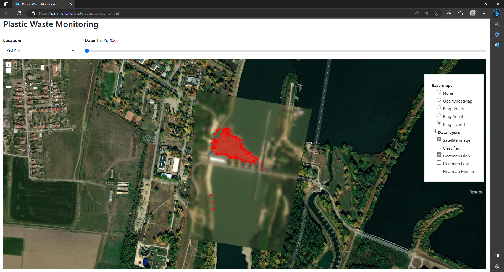

# Waste Detection

Automated waste detection and change analysis based on multispectral satellite imagery, written in Python.

# Desktop Application

This application is designed primarily to facilitate the work of waste collection organisations. The aim was to implement waste detection methods that could be used in practice and make the work of organisations faster and more efficient. The solution developed is compatible with any satellite imagery with at least four bands, which must include the _Blue_, _Green_, _Red_, _Near Infrared_ bands.

The following processes can be performed:

- **Hot-spot detection**: Identification of hot-spots, i.e. illegal waste dumps on medium to high-resolution satellite images in the upper parts of the Tisza (Ukraine, Romania), from which significant amounts of waste are discharged into the river during floods.

- **Floating waste detection**: Identification of water-surface river blockages in medium to high-resolution satellite imagery that can form at known locations on the river (e.g. hydroelectric dams).

- **Washed up waste detection**: Identification of plastic waste that was discharged in the floodplain on high-resolution satellite images.

# Web Application

**Online Demo: [gis.inf.elte.hu/waste-detection/](https://gis.inf.elte.hu/waste-detection/)**

## Description

The goal of our research is to develop an accurate classification method for plastic waste detection to provide a viable platform for repeatable, cost-effective and large-scale monitoring. Such a robust waste monitoring solution would speed up the detection of illegal waste hot-spots close to water flows and floating waste islands on rivers, as well as support waste collection actions with an automatic monitoring system. This application automatically searches for newly recorded satellite images and downloads them on a daily basis. After this a Random Forest model classifies the pictures and displays the results in the web view. You can check out the extension of polluted areas on the set locations in the previous five days when the cloud cover over them was 0%.

## Features

- **Location**: You can choose from four previously set locations: [Kisköre](https://goo.gl/maps/NT4vUMRAMj85fbuo9), [Lake Călinești](https://goo.gl/maps/DdvVcAoQom5bEuGD9), [Pusztazámor](https://goo.gl/maps/PjAxwq1fL6thphRY8) and [Рахів](https://goo.gl/maps/auupf9ozG5aXG9LQ6); or define your own.

- **Date**: It can be changed using the swipe. You can select from the last five most recent days when the cloud cover over the areas was 0%.

- **Colors**:
  - **Classified**: Orange. All pixels that were classified as plastic waste.
  - **Heatmap High**: Red. Pixels that were classified as plastic waste with a confidence of 90% or higher.
  - **Heatmap Medium**: Yellow. Pixels that were classified as plastic waste with a confidence between 80% and 90%.
  - **Heatmap Low**: Green. Pixels that were classified as plastic waste with a confidence below 80%.

# Publications

1. **Waste Detection and Change Analysis based on Multispectral Satellite Imagery** Dávid Magyar, Máté Cserép, Zoltán Vincellér, Attila D. Molnár In Proceedings of KEPAF, art. 53., p. 18., 2023. DOI: [10.48550/arXiv.2303.14521](https://doi.org/10.48550/arXiv.2303.14521)
2. **Comparative Analysis of Riverine Plastic Pollution Combining Citizen Science, Remote Sensing and Water Quality Monitoring Techniques** Attila D. Molnár, Kristóf Málnás, Sára Bőhm, Miklós Gyalai-Korpos, Máté Cserép, Tímea Kiss Sustainability, vol. 16 (12), art. 5040, 2024. DOI: [10.3390/su16125040](https://doi.org/10.3390/su16125040)
